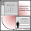

<!-- Improved compatibility of back to top link: See: https://github.com/othneildrew/Best-README-Template/pull/73 -->
<a id="readme-top"></a>
<!--
*** Thanks for checking out the Best-README-Template. If you have a suggestion
*** that would make this better, please fork the repo and create a pull request
*** or simply open an issue with the tag "enhancement".
*** Don't forget to give the project a star!
*** Thanks again! Now go create something AMAZING! :D
-->


<!-- PROJECT SHIELDS -->
<!--
*** I'm using markdown "reference style" links for readability.
*** Reference links are enclosed in brackets [ ] instead of parentheses ( ).
*** See the bottom of this document for the declaration of the reference variables
*** for contributors-url, forks-url, etc. This is an optional, concise syntax you may use.
*** https://www.markdownguide.org/basic-syntax/#reference-style-links
-->

[//]: # ([![Contributors][contributors-shield]][contributors-url])

[//]: # ([![Forks][forks-shield]][forks-url])

[//]: # ([![Stargazers][stars-shield]][stars-url])

[//]: # ([![Issues][issues-shield]][issues-url])

[//]: # ([![LinkedIn][linkedin-shield]][linkedin-url])

# Lecture slide sync

<!-- PROJECT LOGO -->



<br>

[//]: # (<div align="center">)

[//]: # (<!--)

[//]: # (  <a href="https://github.com/DanValnicek/slide-lecture-sync">)

[//]: # (     )

[//]: # (  </a>)

[//]: # (-->)

[//]: # ()

[//]: # ()
[//]: # (  <p align="center">)

[//]: # (    A PDF viewer and video player capable of skipping lecture video by slide.)

[//]: # (    Lecture Slide Sync has a functionality enabling automatic slide to frame synchronization.)

[//]: # ()
[//]: # (    <br />)

[//]: # (    <a href="https://github.com/DanValnicek/slide-lecture-sync"><strong>Explore the docs »</strong></a>)

[//]: # (    <br />)

[//]: # (    <br />)

[//]: # (    <a href="https://github.com/DanValnicek/slide-lecture-sync">View Demo</a>)

[//]: # (    &middot;)

[//]: # (    <a href="https://github.com/DanValnicek/slide-lecture-sync/issues/new?labels=bug&template=bug-report---.md">Report Bug</a>)

[//]: # (    &middot;)

[//]: # (    <a href="https://github.com/DanValnicek/slide-lecture-sync/issues/new?labels=enhancement&template=feature-request---.md">Request Feature</a>)

[//]: # ()
[//]: # (  </p>)

[//]: # (</div>)


<!-- ABOUT THE PROJECT -->

## About The Project

[//]: # (<iframe width="560" height="315")

[//]: # (src="https://youtu.be/Ui0M3u0Rpxk")

[//]: # (frameborder="0")

[//]: # (allow="accelerometer; autoplay; encrypted-media; gyroscope; picture-in-picture")

[//]: # (allowfullscreen></iframe>)

<div align="center">
  <a href="https://www.youtube.com/watch?v=Ui0M3u0Rpxk"></a>
</div>

[//]: # ([![Video showcase]&#40;http://img.youtube.com/vi/Ui0M3u0Rpxk/0.jpg&#41;]&#40;https://youtu.be/Ui0M3u0Rpxk&#41; )

This app was made to make the search for a specific part of lecture easier, by creating a list of time intervals for each slide in a supplied PDF presentation.
The application is made using Pyside6 which is a Qt interface for Python.
The annotations can be created automatically in the app and stored directly inside PDF for later review.
Currently, it works only on Windows.
Jump to the <a href="#usage">usage</a> section to find out more.


<p align="right">(<a href="#readme-top">back to top</a>)</p>

<!-- DIRECTORY STRUCTURE -->

## Directory structure
```
.
├── LICENSE.BSD
├── LICENSE.txt
├── README.md                               - this file
├── __main__.py
├── env
│   └── environment.yml                     - conda environment file
├── images                                  - images for this README.md
├── out
│   ├── build
│   ├── dist
│   │   └── slide-lecture-sync.exe          - precompiled executable for Windows
│   ├── main.spec
│   └── slide-lecture-sync.spec
├── src
│   ├── Argparser.py                         - argument parsing
│   ├── PdfExtender.py                       - code for inserting my developer tag into PDF files
│   ├── SlideIntervals.py                    - slide interval storage data structure
│   ├── SlideMatcher.py                      - the slide-matching implementation
│   ├── Slides.py                            - slide interfacing classes
│   ├── VideoPresentationProcessingWidget.py - menu for GUI video processing implementation
│   ├── __init__.py
│   ├── pdfviewer                            - directory with PDF viewer implementation
│   ├── utils.py
│   ├── videoImgExtraction.py                - entry point for CLI execution
│   └── videoPlayer                          - directory with video player implementation
├── tests 
│   ├── __init__.py
│   ├── providers                            - scripts that provide data to the SlideMatcher_tests
│   ├── test_data                            - data used in testing
│   │   └── IPK_annotation_test_data         - testing annotations for IPK
│   │   └── JSON_interval_annotations        - testing annotations for all lectures in JSON
│   │   └── pdfs                             - pdf files used for testing
│   │   └── videos                           - lecture videos used for testing
│   ├── test_output                          - directory where failure reports are created, historical outputs are included too
│   │   └── Version1                         - Test results of the oldest version
│   │   └── Version2                         - Test results of the version that used TF-IDF
│   │   └── Version3                         - Test results of the latest version
│   └── test_slideMatcher.py                 - the slide-matching accuracy test suite
└── thesis-extras
    └── annotated_pdfs                       - pdfs containing annotations of lectures
    └── BP_Dan_Valnicek_thesis.pdf           - techincal report
    └── BP_slide-video-sync.mp4              - illustrative video of the program
    └── Dan_Valnicek_poster.pdf              - poster
    └── Latex_files.zip                      - files needed for thesis pdf compilation
```
<p align="right">(<a href="#readme-top">back to top</a>)</p>
<!-- GETTING STARTED -->

## Getting Started

 
### Installation

Precompiled .exe is available from releases or from `./out/dist/slide-lecture-sync.exe`. 

> Currently running on linux doesn't work due to issues with the shiboken6 library.
 
Another option is to clone it and run it yourself using conda: 
1. Clone the repo
```sh
git clone https://github.com/DanValnicek/slide-lecture-sync.git
```
2. Install conda by following instructions at [anaconda.com](https://www.anaconda.com/docs/getting-started/miniconda/install#windows-power-shell)
3. Enter `./env` and create and activate environment
```sh
 cd ./env
 conda env create -f environment.yml
 conda activate slide-lecture-sync
```
4. Update the environment
```sh
conda env update -n slide-lecture-sync --prune
```
5. Change directory to project root and run main.py
 ```sh
cd ..
python main.py
```
   

### Testing 
> To run tests the conda environment from the previous section needs to be active.
 
There are 41385 tests, which take multiple hours to run. 
To run the tests execute:
```shell
pytest .\tests
```
The tests generate failure reports for failed tests in PDF.
These reports can be found in `./tests/test_output`. 
The failure reports historically run on different versions are located in the same directory.

#### Testing dataset
The dataset is located in `./tests/test_data`. 
There are multiple types of data each of which has a special provider class located in `./tests/providers`

### Executable compilation
>Executables have to be made with conda environment activated.
 
The executable file can be made using the pyinstaller running this command from the `./out` directory:
```shell
pyinstaller --onefile --name=slide-lecture-sync --paths=../src ../__main__.py --icon=../data/app_icon.ico --noconsole
```
The executable will be created in the `./out/dist` directory.


<p align="right">(<a href="#readme-top">back to top</a>)</p>

 
<!-- USAGE EXAMPLES -->

## Usage

The core of the application is a PDF viewer that can be used normally.
In case the user inserts a PDF with custom interval annotations slide intervals will be shown on the left.
When an interval is clicked for the first time a dialog will pop up asking to choose a video of the lecture.
After this, clicking the intervals will skip the video to the beginning of the interval.

To try out watching videos with annotations take pdf from `./thesis-extras/annotated_pdfs` and open it in the app located
in `./out/dist/` the videos are located in `./tests/test_data/videos`
### Annotation creation
The annotated PDF can be created by accessing `File > Annotate slides in video`.
The menu that pops up will ask for location of the video, the PDF file, and an output PDF file that will be created.
After this information is inserted the "Start Processing" button will start the annotation, which will take
about half the length of the video.
<p align="right">(<a href="#readme-top">back to top</a>)</p>


  <!-- LICENSE -->

## License

Distributed under the project_license. See `LICENSE.txt` for more information.

A portion of the source code is based on Qt examples for PDF viewer and video player.
These files are under the BSD-3 license.
See `LICENSE.BSD` for more information.

<p align="right">(<a href="#readme-top">back to top</a>)</p>

 
<!-- ACKNOWLEDGMENTS -->

## Acknowledgments

* prof. Ing. Adam Herout Ph.D for his supervision of research

<p align="right">(<a href="#readme-top">back to top</a>)</p>


<!-- MARKDOWN LINKS & IMAGES -->
<!-- https://www.markdownguide.org/basic-syntax/#reference-style-links -->

[python-shield]: https://img.shields.io/badge/python-3670A0?style=for-the-badge&logo=python&logoColor=ffdd54
[python-url]: https://www.python.org/

[stars-shield]: https://img.shields.io/github/stars/DanValnicek/slide-lecture-sync.svg?style=for-the-badge

[stars-url]: https://github.com/DanValnicek/slide-lecture-sync/stargazers

[issues-shield]: https://img.shields.io/github/issues/DanValnicek/slide-lecture-sync.svg?style=for-the-badge

[issues-url]: https://github.com/DanValnicek/slide-lecture-sync/issues

[license-shield]: https://img.shields.io/github/license/DanValnicek/slide-lecture-sync.svg?style=for-the-badge

[license-url]: https://github.com/DanValnicek/slide-lecture-sync/blob/master/LICENSE.txt
